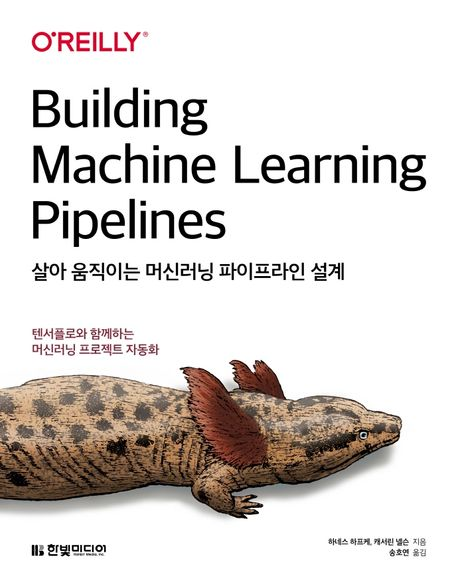

  
<h1 align="center">
  
살아 움직이는 머신러닝 파이프라인 설계

  
</h1>
  
<b>하네스 하프케, 캐서린 넬슨 저 · 송호연 역</b> 
한빛미디어 · 2021년 10월 11일 출시 
[[github](https://github.com/chris-chris/building-machine-learning-pipelines)]</b> 

## :bulb: 목표

- **머신러닝 파이프라인를 이용한 자동화를 공부한다.**

  > TensorFlow library를 사용한 머신러닝 파이프라인을 구축하고, 이를 통해 머신러닝 모델을 자동화한다.

 

## 🚩 정리한 문서 목록

### 📬 Model Serving

- [TensorFlow Serving Part I](https://github.com/erectbranch/ML_Pipeline/tree/master/ch08/summary01)

  > Python API(flask)를 이용한 delivery와 단점

  > TensorFlow Serving: Keras/TF model로 내보내기, model signature(predict, classify, regress), model 검사하기(saved_model_cli)

- [TensorFlow Serving Part II](https://github.com/erectbranch/ML_Pipeline/tree/master/ch08/summary02)

- [PyTorch Serving: REST API](https://github.com/erectbranch/ML_Pipeline/tree/master/ch08/PyTorch)

- [Microsoft Azure Serving: REST API](https://github.com/erectbranch/ML_Pipeline/tree/master/ch08/AzureML_REST_API)

 

## :mag: 목차

### CHAPTER 1 머신러닝 파이프라인

    1.1 머신러닝 파이프라인의 필요성

    1.2 머신러닝 파이프라인을 고려해야 할 시기

    1.3 머신러닝 파이프라인 단계

    1.4 파이프라인 오케스트레이션

    1.5 예제 프로젝트

    1.6 요약

### CHAPTER 2 TFX - 텐서플로 익스텐디드

    2.1 TFX 소개

    2.2 TFX 설치

    2.3 TFX 컴포넌트 개요

    2.4 ML 메타데이터

    2.5 대화형 파이프라인

    2.6 TFX의 대체 솔루션

    2.7 아파치 빔 소개

    2.8 요약

### CHAPTER 3 데이터 수집

    3.1 데이터 수집의 개념

    3.2 데이터 준비

    3.3 수집 전략

    3.4 요약

### CHAPTER 4 데이터 검증

    4.1 데이터 검증의 필요성

    4.2 TFDV – 텐서플로 데이터 검증

    4.3 데이터 인식

    4.4 GCP를 사용한 대용량 데이터셋 처리

    4.5 TFDV를 머신러닝 파이프라인에 통합하기

    4.6 요약

 
### CHAPTER 5 데이터 전처리

    5.1 데이터 전처리의 필요성

    5.2 TFT를 사용한 데이터 전처리

    5.3. 요약

### CHAPTER 6 모델 학습

    6.1 예제 프로젝트의 모델 정의하기

    6.2 TFX Trainer 컴포넌트

    6.3 대화형 파이프라인에서 텐서보드 사용하기

    6.4 분산 학습 전략

    6.5 모델 튜닝

    6.6 요약

### CHAPTER 7 모델 분석 및 검증

    7.1 모델 분석 방법

    7.2 텐서플로 모델 분석

    7.3 공정성을 위한 모델 분석

    7.4 모델 설명 가능성

    7.5 TFX에서의 분석과 검증

    7.6 요약

### CHAPTER 8 텐서플로 서빙을 사용한 모델 배포

    8.1 간단한 모델 서버

    8.2 파이썬 기반 API를 사용한 모델 배포의 단점

    8.3 텐서플로 서빙

    8.4 텐서플로 아키텍처 개요

    8.5 텐서플로 서빙용 모델 내보내기

    8.6 모델 서명

    8.7 내보낸 모델 검사하기

    8.8 텐서플로 서빙 설정

    8.9 텐서플로 서버 구성

    8.10 REST 대 gRPC

    8.11 모델 서버에서 예측하기

    8.12 텐서플로 서빙을 사용한 A/B 모델 테스트

    8.13 모델 서버에서 모델 메타데이터 요청

    8.14 추론 요청 배치 처리

    8.15 배치 예측 구성

    8.16 기타 텐서플로 서빙 최적화

    8.17 텐서플로의 대체 서비스

    8.18 클라우드 공급자를 통한 구축

    8.19 TFX 파이프라인을 사용한 모델 배포

    8.20 요약

### CHAPTER 9 텐서플로 서비스를 사용한 고급 모델 배포

    9.1 배포 주기 분리

    9.2 배포를 위한 모델 최적화

    9.3 텐서플로 서빙에서 TensorRT 사용하기

    9.4 TFLite

    9.5 텐서플로 서빙 인스턴스 모니터링

    9.6 텐서플로 서빙과 쿠버네티스를 사용한 간편한 확장

    9.7 요약

### CHAPTER 10 고급 TFX

    10.1 고급 파이프라인 개념

    10.2 휴먼 인 더 루프

    10.3 사용자 지정 TFX 컴포넌트

    10.4 요약

### CHAPTER 11 파이프라인 1부: 아파치 빔 및 아파치 에어플로

    11.1 오케스트레이션 도구 선택

    11.2 대화형 TFX 파이프라인을 프로덕션 파이프라인으로 변환하기

    11.3 빔과 에어플로를 위한 대화형 파이프라인 변환

    11.4 아파치 빔 소개

    11.5 아파치 빔으로 TFX 파이프라인 조정

    11.6. 아파치 에어플로 소개

    11.7 아파치 에어플로를 사용한 TFX 파이프라인 설정

    11.8 요약

### CHAPTER 12 파이프라인 2부: 쿠베플로 파이프라인

    12.1 쿠베플로 파이프라인 소개

    12.2 쿠베플로 파이프라인을 사용한 TFX 파이프라인 조정

    12.3 구글 클라우드 AI 플랫폼 기반 파이프라인

    12.4 요약

### CHAPTER 13 피드백 루프

    13.1 명시적 피드백과 암묵적 피드백

    13.2 피드백 수집 패턴 설계

    13.3 피드백 루프를 추적하는 방법

    13.4 요약

### CHAPTER 14 머신러닝을 위한 데이터 개인정보 보호

    14.1 데이터 개인정보 보호 문제

    14.2 차등 개인정보 보호

    14.3 텐서플로 개인정보 보호 소개

    14.4 연합 학습

    14.5 암호화된 머신러닝

    14.6 기타 데이터 개인정보 보호 방법

    14.7 요약

### CHAPTER 15 파이프라인의 미래와 다음 단계

    15.1 모델 실험 관리

    15.2 모델 배포 관리에 관한 생각

    15.3 미래의 파이프라인 능력

    15.4 다른 머신러닝 프레임워크와 함께 사용하는 TFX

    15.5 머신러닝 모델 테스트

    15.6 머신러닝을 위한 CI/CD 시스템

    15.7 머신러닝 엔지니어링 커뮤니티

    15.8 요약

### APPENDIX A 머신러닝에 유용한 인프라 소개

    A.1 컨테이너 소개

    A.2 도커 소개

    A.3 쿠버네티스 소개

    A.4 쿠버네티스에 애플리케이션 배포하기

### APPENDIX B 구글 클라우드에 쿠버네티스 클러스터 설정하기

    B.1 시작하기 전에 수행해야 할 작업

    B.2 구글 클라우드의 쿠버네티스

    B.3 쿠베플로 파이프라인을 위한 영구 볼륨 설정

### APPENDIX C 쿠베플로 파이프라인 조작 팁

    C.1 사용자 지정 TFX 이미지

    C.2 영구 볼륨을 사용한 데이터 교환

    C.3 TFX 명령줄 인터페이스

