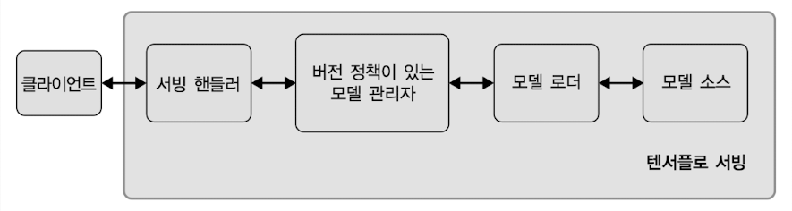

# 8 텐서플로 서빙을 사용한 모델 배포

ML model의 delivery(배포)에는 세 가지 주요 방법이 있다.

- model server(가장 많이 사용)

  - client가 input data를 server에 전송하면, server는 prediction을 생성하고 client에게 전송한다.

- user browser

  - input data를 민감하게 보호할 필요가 있을 경우, 위 model server 방법보다는 user browser에 ML model을 delivery할 수 있다.

- edge device

  - TFLite model로 변환하여 edge device에서 실행하는 등의 방법이 있다.

---

## 8.1 Python API를 이용한 model server

> [Pytorch 버전 정리](https://github.com/erectbranch/ML_Pipeline/tree/master/ch08/PyTorch)

대체로 model server 방법의 delivery는 다음과 같은 workflow를 따른다.

1. (Python) Flask나 django와 같은 web framework를 이용해서 Web App을 만든다.

2. Wep App에 endpoint를 만든다.

3. model architecture와 weight를 불러온다.

4. request를 받으면 (3번에서 load한 Model을 이용하는) predict function을 호출한다.

5. predict output을 HTTP response로 return한다.

간단한 예시 코드를 보자.

```Python
import json
from flask import Flask, request
from tensorflow.keras.models import load_model
# 데이터 구조를 변환하기 위한 전처리를 위한 코드(작성 필요)
from utils import perprocess

# pretrained model을 load
model = load_model('model.h5')
app = Flask(__name__)

# endpoint
@app.route('/classify', methods=['POST'])
def classify():
    complaint_data = request.form["complaint_data"]
    preprocessed_complaint_data = preprocess(complaint_data)
    # predict
    prediction = model.predict([preprocessed_complaint_data])
    # HTTP response(predict 값 반환)
    return json.dumps({"score": prediction})
```

하지만 이 방법은 여러 단점이 있어서 실제로 잘 사용하지 않는다. 이런 delivery 코드는 단순히 시연용으로만 사용하고 실제로는 다른 방법을 사용하는 것이 좋다.

---

### 8.1.1 Python 기반 API를 이용한 model delivery의 단점

앞서 본 예시와 같은 방식이 같은 단점을 한 번 살펴보자.

1. 유지보수가 어렵다.

예시를 보면 API 코드가 model과 분리되지 않고 함께 작성되어 있기 때문에, model을 update하기 위해서는 API 코드도 함께 수정해야 한다.

> 만약 model update 팀과 API 팀이 나뉘어 있다면 동시에 같이 작업해서 지연이 발생하는 것을 막아야 한다. ML 개발자들이 model 구축에는 능숙하지만 보통 API 구축까지는 능숙하지 않기 때문에, 이렇게 팀이 나눈 경우를 생각하면 큰 문제가 될 수 있다.

2. 분기가 없어서 여러 버전의 model을 제어할 수 없다.

예제 코드는 다른 model version의 provisioning(사용자가 사용할 수 있게 준비)을 제공하지 않는다. 이런 기능을 제공하기 위해서는 '새 endpoint를 작성'하거나 '기존 endpoint에 분기 논리를 추가'해야 한다.

그러나 이런 방식은 분기마다 API 수정을 해줄 필요가 생기며, 모든 endpoint를 함께 유지보수하는 데 각별한 주의가 필요하게 된다.

3. 비효율적인 model inference

이 방식을 사용하면 각 request는 개별적으로 preprocessing과 inference 과정을 거치게 된다. 보통 GPU가 pipelining을 통해 여러 작업을 parallel로 동시에 수행 및 처리할 수 있다는 사실을 생각하면, 이런 구현은 굉장히 많은 latency과 낭비를 초래하게 된다.

---

## 8.2 Tensorflow serving

이번에는 TF에서 초기부터 제공한 open source extension 중 하나인 TensorFlow Serving을 이용한 방법을 살펴볼 것이다. TF Serving은 다음과 같은 장점을 가지고 있다.

- TensorFlow graph를 delivery할 수 있다.

- 표준화된 endpoint를 이용한 inference가 가능하다.(delivery한 graph 이용)

- model 및 version 관리가 가능하며, 특정 policy를 기반으로 model을 service한다.

- 다양한 source(예: AWS S3 버킷)에서 model을 load할 수 있다.

   > AWS(Amazon Web Services) S3(Simple Storage Service)은 data를 bucket이라는 단위 안에 객체로 저장하는 객체 스토리지 서비스이다.

- latency를 줄인 고성능 처리가 가능하다.

> 이러한 장점을 가지고 있어서 실제로 많은 기업이 현재 사용하고 있다.

TF Serving의 architecture는 다음과 같다.



- 지정된 source(예: AWS S3 버킷)에서 model을 load

- 지정한 source에 변경 사항이 있으면 **loader**에 feature를 제공해서 알린다.(자동으로 update하게 설정할 수 있다.)

- inference를 model 관리자가 정한 policy에 따라 수행되게 한다.

---

### 8.2.1 TF Serving용 model 내보내기: Keras model

우선 TF Serving에서 model을 이용할 수 있게 내보내는 방법부터 살펴보자. 아래 예시의 model은 8.1절에서 사용한 pretrained model가 여러 framework별로 있다고 가정하고, framework마다 내보내는 방법을 알아보자.

다음은 Keras model을 내보내는 방법이다.

```Python
# 버전 1. TF Serving용 model 내보내기
saved_model_path = model.save(file path="./saved_models", save_format="tf")

# 버전 2. 버전 1의 file path에 timestamp를 적용한 방법
# tf.Estimator가 자동으로 timestamp 경로를 만들어 주는 것처럼, Keras도 동일하게 경로를 만들어서 내보내도록 작성했다.
# model update마다 timestamp가 새로 생성되기 때문에, 이렇게 작성하는 편이model version을 관리하기에 좋다.
import time

ts = int(time.time())
file path = "./saves_models/{}".format(ts)
saved_model_path = model.save(file path=flie path,
                              save_format="tf")
```

> model.save() 시 tags=['...']를 인자로 추가하면, model을 load할 때 해당 tag를 이용해서 load할 수 있다.

---

### 8.2.2 TF Serving용 model 내보내기: TF model

다음은 TF Estimator model을 내보내는 방법을 살펴보자.

- `tf.compat.v1.placeholder`: 나중에 input을 받을 것을 대비해서 미리 공간을 정의하는 함수

- `tf.estimator.export.build_raw_serving_input_receiver_fn`: serving input function을 정의하는 함수.

```Python
import tensorflow as tf

# 1. input receiver 함수 선언
def serving_input_receiver_fn():
    # 예시 input feature
    input_feature = tf.compat.v1.placeholder(dtype=tf.string,
                                             shape=[None, 1],
                                             name="input")

    fn = tf.estimator.export.build_raw_serving_input_receiver_fn(
        features={"input_feature": input_feature}
    )
    return fn
```

이제 model function을 wrapping(래핑)하는 `Estimator` 객체를 만들고, `export_saved_model()` method를 이용해서 model을 내보내자.

> [Custom Estimator 설명](https://hiseon.me/data-analytics/tensorflow/tensorflow-custom-estimator/)

- `tf.estimator.Estimator`: 아래 예시에서는 `model_fn`(params에 따라 graph를 정의하고, 학습, 평가 및 예측에 사용할 모든 Tensor, 작업을 반환하는 model function), `model_dir`(model identifier. 해당 model을 식별할 수 있는 고유의 이름), `params`를 전달한다.

- `tf.estimator.Estimator`는 return 값으로 `tf.estimator.EstimatorSpec` 객체를 return한다. 다음 정보들을 가지고 있다.

  - `mode`: `TRAIN`(훈련 모드, train() 호출), `EVAL`(테스트 모드, evaluate() 호출), `PREDICT`(예측 모드, predict() 호출)

  - `prediction`: (`PREDICT` 모드) predict output을 dict 형태로 return한다.

  - `loss`: (`TRAIN` 또는 `EVAL` 모드) loss를 return한다.

  - `train_op`: (`TRAIN` 모드) 한 step을 train하기 위해 호출하는 operation들을 return한다.

    > 예를 들면 `optimizer` 객체와 `optimizer.minimize()`와 같은 function

  - (optional) `eval_metrics_ops`: (`EVAL` 모드) evaluation에서 사용할 metric을 dict 형태로 return한다.

    > 예를 들면 RMSE

```Python
# Estimator 객체 생성
estimator = tf.estimator.Estimator(model_fn, "model", params={})

# export_saved_model 메서드를 이용해서 model 내보내기
estimator.export_saved_model(
    export_dir_base="saved_models/",
    serving_input_receiver_fn=serving_input_receiver_fn
)
```

다음은 위 코드를 통해 model을 내보냈을 때의 출력 예시다. 별도로 timestame을 작성하도록 코드를 작성하지 않았지만 자동으로 Unix timestamp(유닉스 시간)로 구분하여 model을 내보낸 것을 확인할 수 있다.

> Unix 시간은 1970년 1월 1일 0시 0분 0초 (UTC) 이후로 경과된 초(s, second)를 의미한다. 다양한 system에서 시간을 기록하는 표준 방법 중 하나이며, 아래 예시의 1555875926는 2019년 4월 21일 오후 6시 25분 26초 (UTC)에 model이 내보내졌음을 의미한다.

```bash
...
INFO:tensorflow:Signatures INCLUDED in export for Classify: None
INFO:tensorflow:Signatures INCLUDED in export for Regress: None
INFO:tensorflow:Signatures INCLUDED in export for Predict: ['serving_default']
INFO:tensorflow:Signatures INCLUDED in export for Train: None
INFO:tensorflow:Signatures INCLUDED in export for Eval: None
INFO:tensorflow:No assets to save.
INFO:tensorflow:No assets to write.
INFO:tensorflow:SavedModel written to: saved_models/1555875926/saved_model.pb
Model exported to:  b'saved_models/1555875926'
```

model이 내보내진 폴더와 파일 구조는 다음과 같다.

> tree 명령어를 설치해서 파악했다.(MACOS에서 brew install tree로 설치하였다.)

- saved_model.pb: model architecture(graph)와 weight가 합쳐진 파일. 

- variables/: 여러 variables와 model의 train checkpoint가 담긴 디렉터리

- assets/: model에 필요한 다른 파일들(asset)이 담긴 디렉터리. 예를 들면 vocabulary.

```bash
$ tree saved_models/
saved_models/
└── 1555875926
    ├── assets
    │   └── saved_model.json
    ├── saved_model.pb
    └── variables
        ├── checkpoint
        ├── variables.data-00000-of-00001
        └── variables.index
```

이렇게 내보낸 model을 SavedModel이라 지칭한다. 하지만 TF Serving에서 model을 delivery하기 위해서는, model의 input과 output 형식을 정의하는 **signature**가 필요하다.

---

## 8.3 model signature

**signature**는 TF graph에서 input과 output tensor를 지정하는 딕셔너리다. 예를 들어 image classification model의 경우 signature는 다음 정보를 포함한다.

- input image tensor: name, shape, data type

- output tensor: name, shape, class label

위 정보를 포함하는 signature 딕셔너리 예시를 보자.

```JSON
{
    'inputs': {'input_image': <tf.Tensor 'input_image:0' shape=(None, 224, 224, 3) dtype=float32>},
    'outputs': {'class_ids': <tf.Tensor 'class_ids:0' shape=(None,) dtype=int64>}
}
```

- 입력 정보는 `inputs`라는 key로 지정한다.

  - input image tensor name: `input_image`

  - input tensor shape: (None, 224, 224, 3)

  > None은 input batch size가 동적으로 조정될 수 있음을 나타낸다.

  - data type: float32

- 출력 정보는 `outputs`라는 key로 지정한다.

  - output tensor name: `class_ids`

  > 즉, tensor의 각 element가 `class_ids`를 나타낸다는 의미다.

  - output tensor shape: (None,)

  - data type: int64

client는 signature 형식을 바탕으로 data를 전달한다. server는 전달받은 signature를 참조해서 model의 input과 output을 적절하게 처리하고, API client에게 결과를 반환한다.

---

### 8.3.1 model signature 유형

signature는 크게 세 가지 유형으로 나뉜다.

- **predict**: TF Serving의 PREDICT API(tensorflow/serving/predict) 호출에 사용된다.

  - 임의의 수의 input 및 output으로 구성된다.

- **classify**: TF Serving의 Classification API(tensorflow/serving/classify) 호출에 사용된다.

  - 하나의 input tensor와 하나 이상의 output tensor(classes, scores)로 구성된다.

- **regress**: TF Serving의 Regression API(tensorflow/serving/regress) 호출에 사용된다.

  - 하나의 input tensor와 하나의 output tensor로 구성된다.

---

### 8.3.2 model signature: predict

default signature에 해당되며 가장 유연한 signature 방법인 predict부터 살펴보자. 아래는 NLP model에서 input과 output을 받기 위해 정의한 signature다.

```JSON
signature_def: {
    key  : "prediction_signature"
    value: {
        inputs: {
            key  : "inputs"
            value: {
                name: "sentence:0"
                dtype: DT_STRING
                tensor_shape: ...
            },
            ...
        }
        outputs: {
            key  : "scores"
            value: {
                name: "y:0"
                dtype: ...
                tensor_shape: ...
            }
        }
        method_name: "tensorflow/serving/predict"
    }
}
```

- `inputs`: "sentence:0"이라는 이름을 가진 string tensor(DT_STRING. UTP-8 encoding되어 있다.)를 input tensor로 사용한다.

  > [string tensor](https://hyoungteak.github.io/ai/TensorFlow-Core-2/)

- `outputs`: "y:0"은 output node 이름을 뜻한다.(score이므로 dtype은 float32나 DT_FLOAT일 것이다.)

- `method_name`: 이 signature는 "tensorflow/serving/predict" method를 통해 호출횐다.

---

### 8.3.3 model signature: classify

두 번째 signature 방법은 classify이다. 하나의 inputs와 하나 이상의 outputs로 구성된다.

```JSON
signature_def: {
    key  : "classification_signature"
    value: {
        inputs: {
            key  : "inputs"
            value: {
                name: "sentence:0"
                dtype: DT_STRING
                tensor_shape: ...
            }
        }
        outputs: {
            key  : "classes"
            value: {
                name: "y_classes:0"
                dtype: DT_UINT16
                tensor_shape: ...
            }
        }
        outputs: {
            key  : "scores"
            value: {
                name: "y:0"
                dtype: DT_FLOAT
                tensor_shape: ...
            }
        }
        method_name: "tensorflow/serving/classify"
    }
}
```

---

### 8.3.4 model signature: regress

마지막 signature 방법은 regress이다. 하나의 inputs와 하나의 outputs로 구성된다. 이름 그대로 regression model용으로 설계되었다.

```JSON
signature_def: {
    key  : "regression_signature"
    value: {
        inputs: {
            key  : "inputs"
            value: {
                name: "input_tensor_0"
                dtype: ...
                tensor_shape: ...
            }
        }
        outputs: {
            key  : "outputs"
            value: {
                name: "y_outputs_0"
                dtype: DT_FLOAT
                tensor_shape: ...
            }
        }
        method_name: "tensorflow/serving/regress"
    }
}
```

---

## 8.4 model 검사하기

model을 TF serving으로 배포하기 전 model을 검사해야 한다. 이를 위해서는 우선 TF serving Python API를 설치해야 한다.

```bash
$ pip install tensorflow-serving-api
```

TF serving API를 설치했다면 이제 터미널에서 `saved_model_cli` 명령을 입력해서 model에서 다음 두 가지를 검사할 수 있다.

- SavedModel signature 검사

- SavedModel test: input data를 test할 때 매우 유용하다.

---

### 8.4.1 saved_model_cli: signature input, output 검사

간단히 `show --dir {디렉터리} --all`을 명령에 붙여주는 것만으로 해당 디렉터리의 SavedModel을 모두 검사할 수 있다.

```bash
$ saved_model_cli show --dir saved_models/ --all
```

`--all` 옵션을 제외하고 위 명령을 단계별로 수행하며 검사하는 방법도 설명을 위해 살펴보자.

앞서 본 명령에서 `--all` 옵션을 제외하고 시도하면, model.save()에서 지정한 tag 이름(8.2.1절 참고)을 표시해 준다. 

> train용, test용 등으로 tag 이름을 나눌 수도 있고, 다양한 환경(CPU, GPU 등)에 따라서도 tag 이름을 나눌 수 있다.

> model 자체가 CPU, GPU 등 다양한 환경마다 서로 다른 graph를 갖는 경우도 있다. 이런 경우에도 tag가 여러 개 표시된다.

이렇게 파악한 tag 이름을 `--tag_set` 옵션과 함께 사용하면, model의 signature가 정의된 `SignatureDefs`를 확인할 수 있다. 예시는 'serve'라는 tag 이름을 가졌다고 하자.

```bash
$ saved_model_cli show --dir saved_models/ --tag_set serve
```

model이 가진 signature가 출력되는데, `--signature_def` 옵션과 signature의 이름을 함께 명령에 붙여주면 이제 signature 정보도 확인할 수 있다. 예시는 'serving_default'라는 signature 이름을 가졌다고 하자.

```bash
$ saved_model_cli show --dir saved_models/ --tag_set serve --signature_def serving_default
```

여기까지 도달하면 `--all` 옵션을 사용했을 때와 동일한 결과를 얻을 수 있다.

---

### 8.4.2 saved_model_cli: input data test

이번에는 `saved_model_cli`를 사용해서 SavedModel을 test해보자. test를 위해 input을 넘기는 방법에는 세 가지 종류가 있다.

- `--inputs`: numpy array(ndarray)로 포맷된 input data를 넘긴다.

- `--input_exprs`: python 식으로 input data를 정의할 수 있다. 식에서 numpy feature를 사용할 수도 있다.

- `--input_examples`: tf.Example 형식으로 포맷한 input data를 넘긴다.

또한 test로 도출되는 output을 처리할 여러 옵션도 있다.

- `--outdir`: 디렉터리를 주면 stdout으로 모든 graph output을 파일에 써서 저장한다.

- `--overwrite`: 출력을 특정 파일에 쓰려면 해당 옵션으로 파일을 덮어쓸 수 있게 한다.

- `--tf_debug`: TFDBG(TensorFlow Debugger)를 사용해서 model graph를 단계별로 살펴볼 수 있다.

```bash
$ saved_model_cli_run --dir saved_models/ \
                      --tag_set serve \
                      --signature_def x1_x2_to_y \
                      --input_examples 'examples=[{"company": "HSBC", ...}]'
```

---